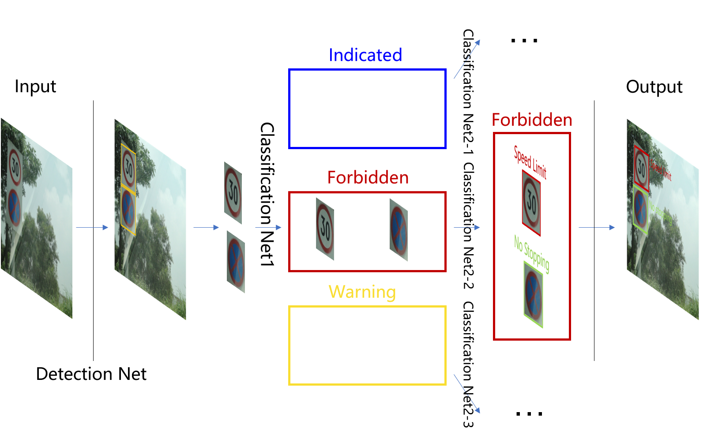
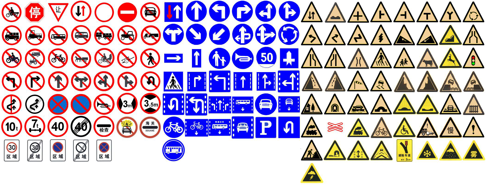
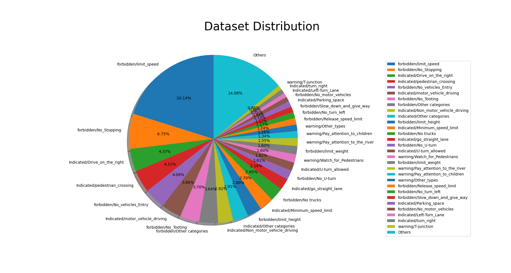
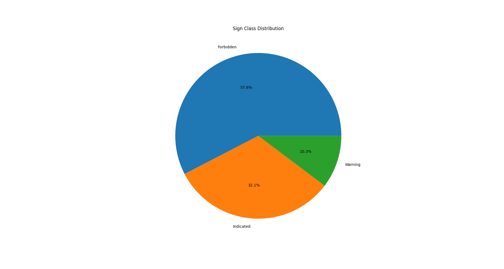

+ **Dataset**

  数据集将图片中的交通指示牌进行分类，主要分为 *Forbidden*,*Indicated* 和 *Warning* 三大类，而三大类下又可以分为若干小类。其中，我们将中国主要的交通指示牌按照大类进行分类，列于下图中。



+ 

  数据集位于用户adc2家目录下的 */dataset/sign* 文件夹下，其中的 */images* 文件夹下包含所有图片， */annotations* 文件夹下包含所有的标注信息， 而 *Classification_v2* 文件夹下包含有所有的交通指示牌实例。我们将数据集的统计信息列于 */home/adc2/efficientnet-pytorch/statistics.txt* 文件中，其内容如下：

  ``` txt
  forbidden/limit_speed -- 8265 
  ```

  在此，我们仅以第一行为例，*statistics.txt* 文件的第一行含义为在数据集中， category 为 forbidden, sub-category 为 limit_speed 的实例数目为 8265。

  

  

  

  

  数据集中数目较多的前三十种指示牌类别数目分布列于上图，我们可以看出数目最多的前三十种指示牌占据了数据集的大约86%。另外，有53中指示牌的实例数目多于100（Tsinghua-Tencent 100K中此数目为30）。

  

上图显示出了数据集中不同category的交通指示牌的数目分布情况。其中 *forbidden* 类型的交通指示牌占据了数据集的大半部分。

+ **Detection Net**

  - 使用yolov3作为检测网络，其对应于192.168.14.18服务器下adc2家目录下的 */yolov3* 文件夹。文件夹中包含 *train.py*, *detect.py*文件，可以用于训练和检测，具体使用方法可参见[yolov3](https://github.com/ultralytics/yolov3)。在训练过程将所有 *epoch = 10\*n* 的网络参数存储于 */weight* 文件夹下。

  - 另外，如果将*detect.py*文件中将变量*classify* 设置为True，可以对检测目标进行分类；如果将*classify*设置为False，则只进行检测。
  - 在进行训练的时候，可能会因为不同参数位于不同的GPU上，如果遇到这种问题，可以在运行Python文件时，在命令前加上 *CUDA_VISIBLE_DEVICES=0*。

+ **Classification Net**

  使用efiicientnet作为分类网络，其对应于adc2家目录下的 */efficient-pytorch*文件夹。训练代码为 *train_v2.py* 文件，用于训练，训练过程中的Loss和Accuracy记录于 */result.txt* 文件中。训练的数据集位置在 */home/adc2/dataset/sign/Classification_v2* 文件夹下，其中的 */train* 文件夹中，包含三个文件夹 *Forbidden*，*Indicated* 和 *Warning*。三个文件夹下的包含有对应类别的图片。由于我们采用的efiicientnet-B6, 所以对应的输入图像大小为 (528,528), *dataset_v1.py* 中包含加载数据集函数的代码。训练过程中将所有 *epoch = 10\*n + 1* 的网络参数存储于 */home/adc2/dataset/sign/Classification_v2/model* 文件夹下。

